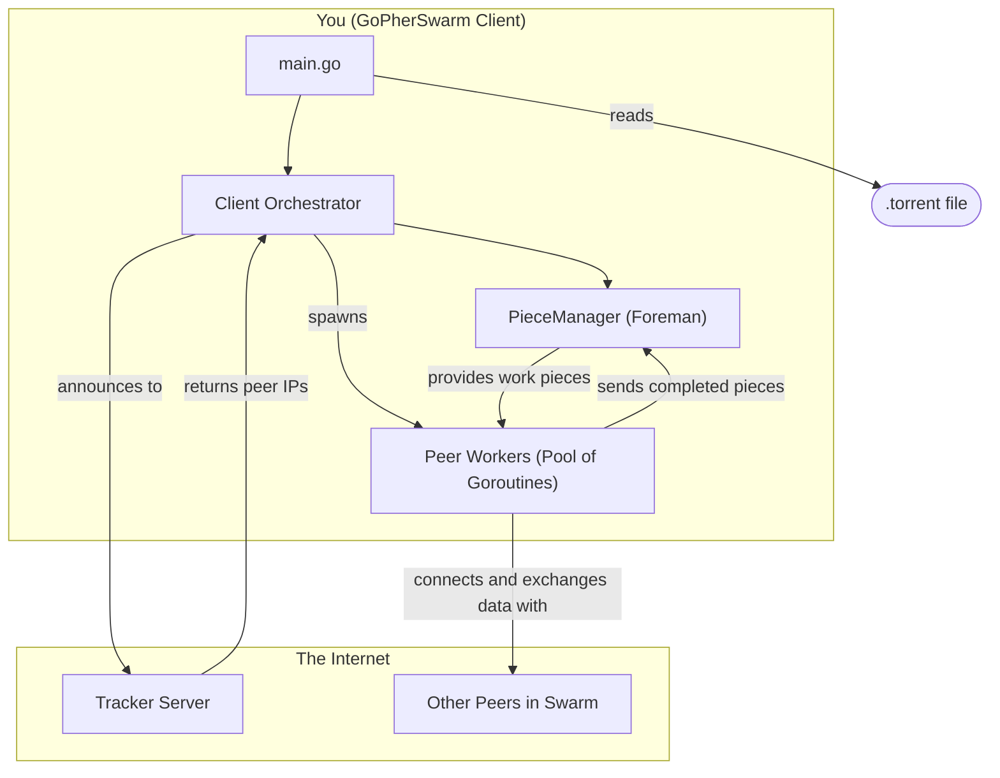

# GoPherSwarm - A BitTorrent Client in Go

<p align="center">
  
  &nbsp; &nbsp; &nbsp; &nbsp;
  
</p>
<p align="center">
  <i>A functional BitTorrent client written from scratch to explore concurrency, networking, and distributed systems in Go.</i>
</p>

---

GoPherSwarm is a functional BitTorrent client written from scratch in Go. This project was built as a deep dive into concurrency, networking, and low-level protocol implementation. It is capable of parsing `.torrent` files, communicating with trackers, connecting to peers, and downloading files from the BitTorrent network.

This client is an educational tool designed to explore the inner workings of a complex, distributed P2P system.

## In Action

A screenshot of GoPherSwarm successfully downloading a file from the BitTorrent network, showcasing the real-time progress bar and download speed.


<details>
  <summary><b>Click to see the startup and tracker communication details</b></summary>
  
  The client starts by parsing the torrent file, extracting its metadata, and making a request to the tracker to discover peers before initiating the download.
  
  
</details>

## Features

-   **`.torrent` File Parsing:** Full support for parsing Bencoded torrent metadata files.
-   **Tracker Communication:** Communicates with HTTP trackers to discover peers.
-   **Peer-to-Peer Protocol:** Implements the full peer wire protocol, including:
    -   Handshake
    -   Bitfield exchange
    -   Choke/Unchoke mechanism
    -   Interested/Not Interested messages
    -   Request/Piece message flow for data transfer
-   **Concurrent Downloading:** Utilizes Go's powerful concurrency features (goroutines and channels) to download from multiple peers simultaneously.
-   **Pipelined Requests:** Requests multiple blocks of a piece at once to keep the TCP connection saturated and maximize download speed.
-   **Piece Verification:** Verifies the SHA-1 hash of every downloaded piece to ensure data integrity.
-   **Graceful Shutdown:** Handles `Ctrl+C` interrupts to shut down cleanly.

## Architecture

The client is built on a concurrent "Foreman and Workers" model, separating state management from network I/O. The overall data flow follows the classic BitTorrent architecture.



-   **`main.go`:** The entry point. Handles command-line arguments, initiates the download, and manages the final file assembly.
-   **`p2p/bencode.go`:** A robust, from-scratch parser and marshaller for the Bencode data format.
-   **`p2p/torrent.go`:** Logic for parsing `.torrent` files and calculating the crucial `InfoHash`.
-   **`p2p/tracker.go`:** Handles all HTTP communication with the torrent's tracker to retrieve a list of peers.
-   **`p2p/message.go` & `p2p/peer.go`:** Defines the low-level data structures and serialization/deserialization logic for the peer wire protocol.
-   **`p2p/piece.go`:** The "Foreman". A central `PieceManager` that tracks the state of every piece (needed, in-progress, verified) and manages the work queue.
-   **`p2p/client.go`:** The "Orchestrator". Manages the overall download state and spawns a dedicated "Worker" goroutine for each peer connection.

## How to Run

### Prerequisites
- Go 1.18 or higher.
- A `.torrent` file for a well-seeded, publicly available file (e.g., a Linux distribution like [Ubuntu](https://ubuntu.com/download/alternative-downloads)).

### Build
```bash
go build
```

### Usage
To start a download, run the executable with the path to a `.torrent` file as the argument:

```bash
./gopherswarm /path/to/your/ubuntu.iso.torrent
```

The application will connect to the tracker, find peers, and begin downloading. The final file will be saved in the same directory where you run the command.

Press `Ctrl+C` at any time to gracefully shut down the client.

## Acknowledgements

This project was a significant learning endeavor, and its development was greatly aided by the excellent resources from the community. Special thanks to:

-   **Arpit Bhayani** for his clear and insightful videos on peer-to-peer networks and system design.
-   **Jesse Li** for the incredibly detailed and well-written blog post, "[Building a BitTorrent client from the ground up in Go](https://blog.jse.li/posts/torrent/)," which served as an invaluable reference.

## Key Concepts Learned

This project provides hands-on experience with:
-   **Advanced Concurrency:** Managing complex state across many goroutines using channels and mutexes.
-   **Network Programming:** Low-level TCP communication, implementing a binary protocol from a specification, and interacting with HTTP APIs.
-   **Data Serialization:** Writing a custom parser for a non-standard data format (Bencode).
-   **System Design:** Architecting a resilient, multi-stage, concurrent application with a clean separation of concerns.
-   **Graceful Shutdown:** Using the `context` package to handle interrupts and ensure the application closes cleanly.
